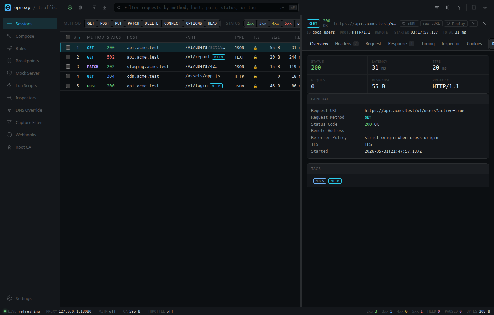
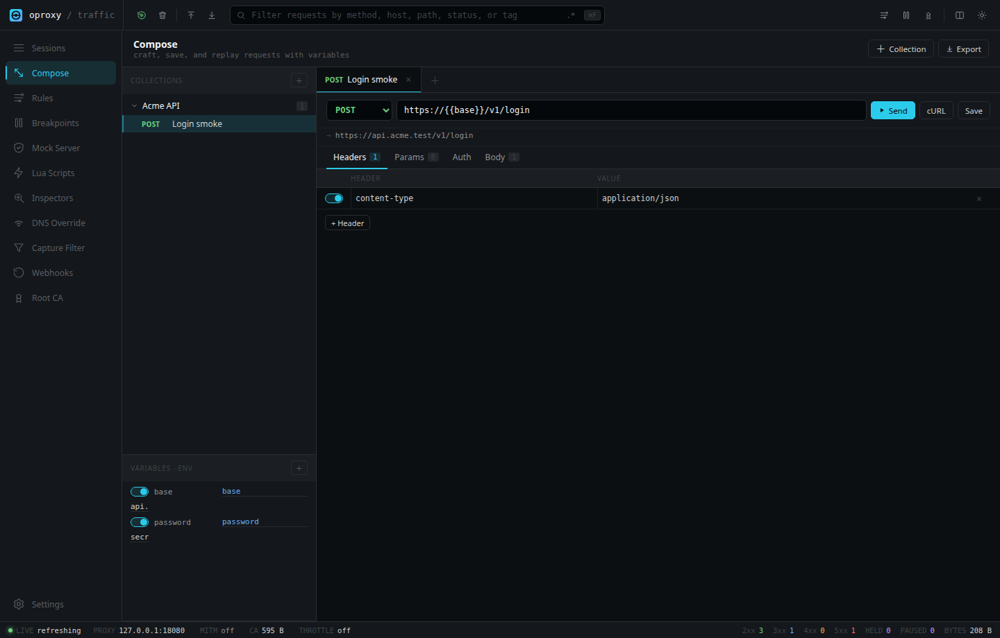

# oproxy

oproxy is a local HTTP, HTTPS, and SOCKS5 proxy for inspecting, replaying, and modifying traffic.

It is for developers testing browsers, CLIs, mobile apps, API clients, services, and test suites on their own machine or in a local Docker container.

## Features

- Capture HTTP traffic and HTTPS traffic after trusting the local oproxy CA.
- View requests, responses, headers, bodies, status, timing, tags, notes, and selected inspector data.
- Replay captured requests and open them in Compose.
- Build manual requests with headers, query params, auth, raw bodies, variables, collections, and cURL export.
- Export captures as HAR or generated cURL, Fetch, and Python snippets.
- Modify traffic with rule sets, map-remote, map-local, access rules, throttling, breakpoints, mock responses, DNS overrides, capture filters, Lua scripts, and upstream proxy chaining.
- Run from source or Docker with persistent volumes for CA material and local state.

## Demo

[Short demo video](docs/assets/demo.webm)


## Quick Start

### Docker

```bash
docker run --rm \
  --name oproxy \
  -p 127.0.0.1:8080:8080 \
  -p 127.0.0.1:1080:1080 \
  -e OPROXY_BIND_HOST=0.0.0.0 \
  -e OPROXY_MITM_ENABLED=true \
  -v oproxy-certs:/app/certs \
  -v oproxy-storage:/app/storage \
  ghcr.io/sauravrao637/oproxy:latest
```

Open `http://127.0.0.1:8080`.

Or build locally:

```bash
docker build -t oproxy:latest .
```

### Docker Compose

```bash
docker compose up --build
```

The included Compose file uses host networking, persists `/app/certs` and `/app/storage`, and sets `OPROXY_BIND_HOST=0.0.0.0`.

### Source

Requirements:

- Rust 1.85 or newer
- Node.js 22 or newer
- Yarn via Corepack

```bash
corepack enable
yarn --cwd src/design install --frozen-lockfile
yarn --cwd src/design build
cargo run --release
```

Open `http://127.0.0.1:8080`.

### First Request

```bash
curl -x http://127.0.0.1:8080 http://example.com
```

The request appears in the Sessions view.

### First HTTPS Capture

```bash
curl http://127.0.0.1:8080/admin/ca -o oproxy-ca.crt
curl --cacert oproxy-ca.crt -x http://127.0.0.1:8080 https://example.com
```

For browser HTTPS capture, install the CA from `http://127.0.0.1:8080/admin/ca` into the browser or OS trust store.

## What It Can Do

- Act as a forward HTTP proxy on `OPROXY_PORT`/`port`, default `8080`.
- Serve the local management UI and API from the same listener.
- Intercept HTTPS CONNECT traffic when MITM is enabled and the client trusts the generated CA.
- Optionally listen for SOCKS5 CONNECT traffic on `socks5_port`.
- Optionally run a second TLS listener with `https_port`.
- Capture live sessions in memory with bounded session and body retention.
- Save and load sessions explicitly with admin endpoints.
- Export HAR, cURL, Fetch, and Python snippets, redacted by default.
- Import HAR files and oproxy JSON session data.
- Stream session-change notifications with server-sent events.
- Inspect JWT, GraphQL, gRPC, and WebSocket frame metadata when matching traffic is captured.

## Use Cases

- Debug a browser or CLI request without changing application code.
- Replay a captured request after editing headers or body in Compose.
- Test a frontend against mock responses or local fixture files.
- Route a subset of traffic to a staging service.
- Reproduce slow or bandwidth-limited responses.
- Pause matching requests or responses before they continue.
- Validate how a client behaves when requests are blocked, redirected, or rewritten.

## Screenshots





## Documentation

- [Getting started](docs/getting-started.md)
- [Docker](docs/docker.md)
- [HTTPS MITM](docs/https-mitm.md)
- [Compose](docs/compose.md)
- [DNS overrides](docs/dns-overrides.md)
- [SOCKS5](docs/socks5.md)
- [Configuration](docs/configuration.md)
- [Troubleshooting](docs/troubleshooting.md)
- [Security](docs/security.md)

## License

MIT
