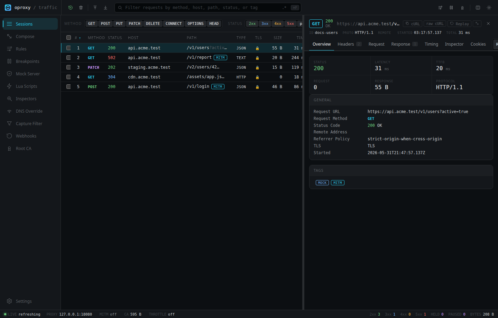
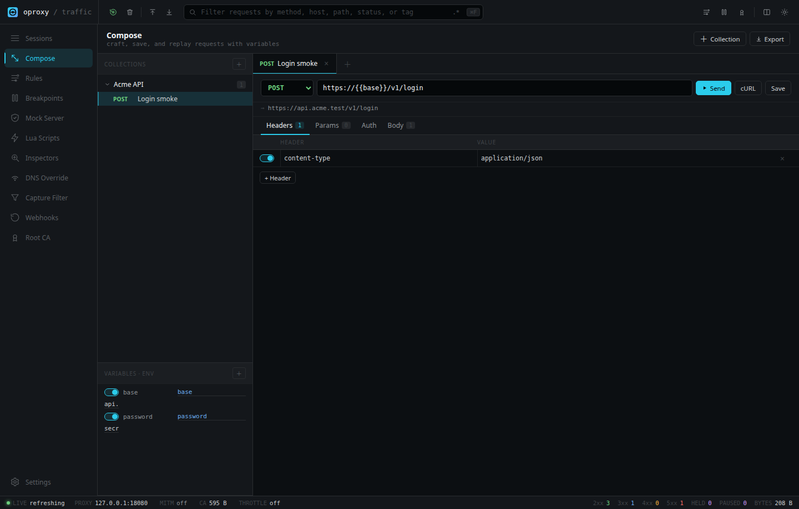

# oproxy

<p align="center">
  <a href="https://trendshift.io/repositories/47640?utm_source=trendshift-badge&amp;utm_medium=badge&amp;utm_campaign=badge-trendshift-47640" target="_blank" rel="noopener noreferrer">
    
  </a>
</p>

oproxy is a local HTTP, HTTPS, HTTP/3, WebSocket, and SOCKS5 proxy for inspecting, replaying, and modifying traffic from browsers, CLIs, mobile apps, API clients, services, and test suites.

It runs a web UI, API, and optional AI assistant on the same local listener, so you can capture traffic, inspect requests and responses, replay requests, mock upstreams, rewrite traffic, throttle responses, and export reproducible snippets without changing application code.

The Assistant is an OpenAI-compatible control-plane client: it can inspect current proxy state through allowlisted tools and prepare traffic/configuration changes as reviewable confirmation cards.

> Security note: HTTPS interception requires trusting a local oproxy root CA. Install that CA only on machines and browsers you control, keep the generated private key safe, and do not expose the admin UI without a strong token.

## Highlights

- Capture HTTP and HTTPS traffic, with MITM support for HTTPS.
- Inspect headers, bodies, status, timing, tags, notes, JWTs, GraphQL, gRPC metadata, and WebSocket frames.
- Replay captured requests or edit them in Compose.
- Export captures as HAR, cURL, Fetch, or Python snippets.
- Modify traffic with rules, mocks, map-local/map-remote, access rules, throttling, breakpoints, DNS overrides, Lua scripts, and upstream proxy chaining.
- Use the Assistant to inspect sessions, understand proxy state, and prepare confirmed changes through an OpenAI-compatible chat model.
- Run from Docker, Docker Compose, or source.

## Quick Start

### Docker

```bash
docker run --rm \
  --name oproxy \
  -p 127.0.0.1:8080:8080 \
  -p 127.0.0.1:1080:1080 \
  -p 127.0.0.1:8443:8443/udp \
  -e OPROXY_BIND_HOST=0.0.0.0 \
  -e OPROXY_MITM_ENABLED=true \
  -e OPROXY_HTTP3_ENABLED=true \
  -e OPROXY_HTTP3_PORT=8443 \
  -e OPROXY_ALLOW_REMOTE_ADMIN=true \
  -e OPROXY_ADMIN_TOKEN=change-me-to-a-strong-secret \
  -v oproxy-certs:/app/certs \
  -v oproxy-storage:/app/storage \
  ghcr.io/sauravrao637/oproxy:latest
```

Open `http://127.0.0.1:8080` and sign in with the token.

Docker bridge networking needs `OPROXY_BIND_HOST=0.0.0.0`. The command above still publishes ports only on host loopback. Change `OPROXY_ADMIN_TOKEN` before real use.

### Docker Compose

```bash
docker compose up --build
```

The checked-in Compose file enables MITM, HTTP/3 on UDP `8443`, persistent certs/state, and a healthcheck.

### Source

Requirements: Rust 1.85+, Node.js 22+, and Yarn via Corepack.

```bash
corepack enable
yarn --cwd src/design install --frozen-lockfile
yarn --cwd src/design build
cargo run --release
```

Open `http://127.0.0.1:8080`.

## First Capture

```bash
curl -x http://127.0.0.1:8080 http://example.com
```

The request appears in the Sessions view.

For HTTPS:

```bash
curl http://127.0.0.1:8080/admin/ca -o oproxy-ca.crt
curl --cacert oproxy-ca.crt -x http://127.0.0.1:8080 https://example.com
```

For browser HTTPS capture, configure the browser or OS to use `127.0.0.1:8080` as the HTTP and HTTPS proxy, then import the CA from `http://127.0.0.1:8080/admin/ca`.

## Demo

[Short demo video](docs/assets/demo.webm)





## Learn More

- [Getting started](docs/getting-started.md)
- [Docker](docs/docker.md)
- [HTTPS MITM](docs/https-mitm.md)
- [Assistant](docs/assistant.md)
- [Configuration](docs/configuration.md)
- [Security](docs/security.md)
- [Troubleshooting](docs/troubleshooting.md)
- [Architecture](architecture.md)
- [Contributing](CONTRIBUTING.md)

## License

oproxy is licensed under the [MIT License](LICENSE).
